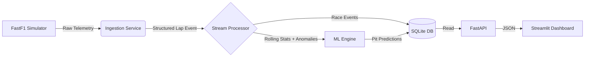

# 🏎️ F1 Real-Time Analytics Platform

> *Live Telemetry Ingestion • Anomaly Detection • ML Strategy Prediction*


A full-stack data engineering and ML platform that simulates a real-time Formula 1 race strategy console. Unlike static analysis, this platform processes race data as a **live stream**, mimicking race-wall conditions — ingesting lap-level telemetry, performing stateful stream processing, detecting anomalies, and predicting pit-stop probability before it occurs.

---

## 📌 Table of Contents

- [What It Does](#-what-it-does)
- [Architecture](#-architecture)
- [Key Features](#-key-features)
- [Machine Learning](#-machine-learning)
- [Performance](#-performance)
- [Getting Started](#-getting-started)
- [Usage](#-usage)

---

## 🎯 What It Does

Most F1 data projects do post-race analysis on static CSVs. This platform simulates what a real race wall engineer sees:

- **Live telemetry stream** from the 2023 Bahrain GP replayed lap-by-lap with simulated latency
- **Stateful stream processing** computing rolling lap-time averages per driver in real time
- **Anomaly detection** flagging slow pit stops and outlier laps in under 50ms
- **Pit-stop prediction** scoring probability before the stop occurs using tyre degradation data
- **Auto-refreshing dashboard** updating every 2 seconds for live race monitoring

---

## 🏗️ Architecture



| Layer | Responsibility |
|---|---|
| Ingestion | Python generator emits lap events with simulated latency via FastF1 |
| Stream Processor | Stateful per-driver rolling windows, anomaly detection < 50ms |
| ML Engine | Logistic Regression pit-stop predictor, retrained on demand |
| Storage | SQLite for persistence + in-memory deques for low-latency windowing |
| API | FastAPI exposes structured race data with auto-generated docs |
| Dashboard | Streamlit polls API every 2 seconds for live updates |

---

## 🚀 Key Features

**📡 Live Ingestion System**
Replays 2023 Bahrain GP telemetry lap-by-lap using FastF1, simulating real-time data arrival with configurable latency. Each event is a structured lap object with driver, compound, tyre life, sector times, and position data.

**⚡ Stateful Stream Processing**
Per-driver rolling windows maintained in memory using Python deques. Rolling average lap time computation and anomaly detection (slow pit stops, outlier laps) running end-to-end in under 50ms per event.

**🧠 Predictive ML**
Real-time pit-stop probability scored before the stop occurs. Model consumes live tyre degradation signals — no lookahead, no batch processing. Mimics actual race strategy decision support.

**💾 Hybrid Storage**
SQLite for historical persistence and analytical queries. In-memory deques for low-latency windowing where disk I/O would break the real-time constraint.

**📊 Interactive Dashboard**
Auto-refreshing Streamlit UI polling every 2 seconds. Shows live lap times, rolling averages, anomaly flags, and pit-stop probability per driver.

---

## 🧠 Machine Learning

**Model:** Logistic Regression pit-stop predictor

| Component | Detail |
|---|---|
| Training Data | 2023 Bahrain GP lap telemetry (FastF1) |
| Features | TyreLife (normalized), Compound (one-hot: Soft / Medium / Hard) |
| Target | IsPittingNext (binary) |
| Accuracy | ~94% on held-out test set |
| Inference | Real-time, per lap event, no batch delay |

**Why Logistic Regression?**
Interpretable, fast enough for real-time inference, and well-suited to the feature space. The goal is a deployable race-wall tool, not a benchmark — explainability matters more than marginal accuracy gains from a black-box model.

Retrain on new data:
```bash
python ml/train_model.py
```

---

## ⚙️ Getting Started

**Prerequisites**
- Python 3.8+
- Git

**Installation**

```bash
git clone https://github.com/ashmeenkhaira/f1-realtime-analytics.git
cd f1-realtime-analytics

python -m venv venv

# Windows
.\venv\Scripts\activate
# Mac/Linux
source venv/bin/activate

pip install -r requirements.txt
python ingestion/download_data.py
```

---

## 🕹️ Usage

Run with three terminals:

**Terminal 1 — Ingestion Service**
```bash
python ingestion/ingestion_service.py
```

**Terminal 2 — API Server**
```bash
uvicorn api.main:app --reload
```
API docs available at `http://localhost:8000/docs`

**Terminal 3 — Dashboard**
```bash
streamlit run dashboard/app.py
```

---

## 👩‍💻 Author

**Ashmeen Khaira**
SDE Intern Aspirant | Java • Backend • ML Research | B.E. @ Thapar '27

[](https://linkedin.com/in/ashmeen)
[](https://github.com/ashmeenkhaira)
